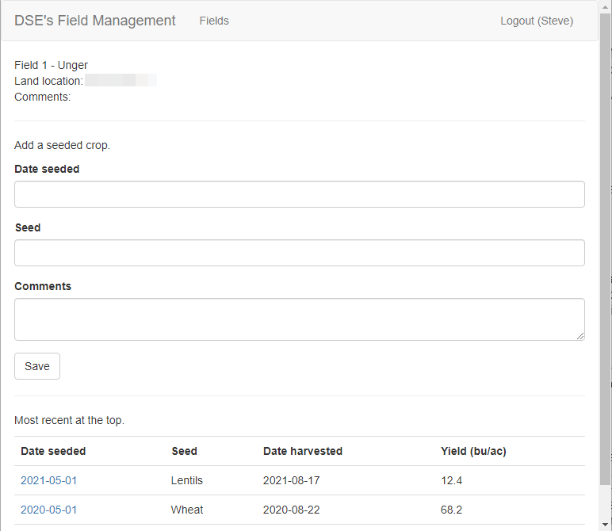

## Under Development

This is a Field Management web app for DSE based on concepts learned from...

The Flask tutorial, [Part 1](https://blog.pythonanywhere.com/121/) and [Part 2](https://blog.pythonanywhere.com/158/), posted in two parts by Giles at the PythonAnywhere blog. My adjustments were using Python 3.9.

and...

The [Flask Mega-Tutorial](https://blog.miguelgrinberg.com/post/the-flask-mega-tutorial-part-i-hello-world) by Miguel.

## Screenshots

